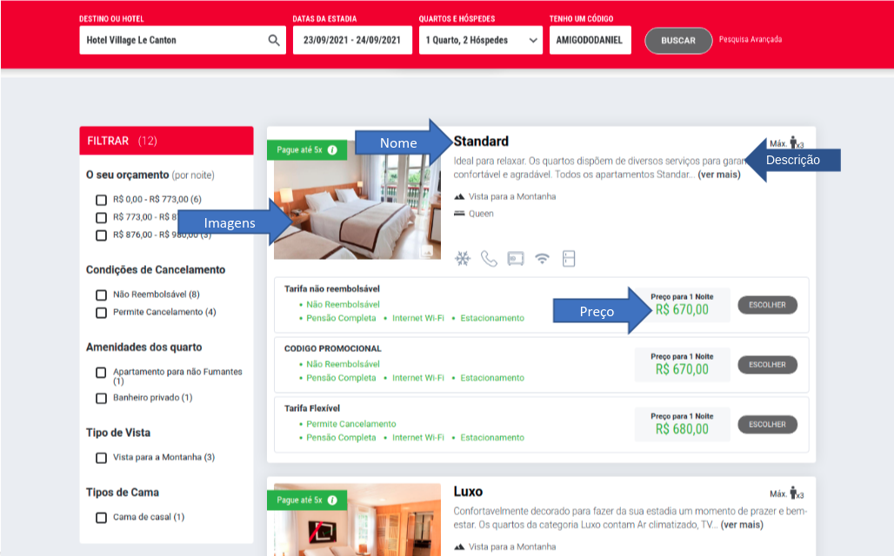

# Test Dev Asksuite

Hey! Glad you're here.
I'm going to explain exactly what you'll have to implement in this test and what we expect as outcome.

First of all, we have this nice express.js boilerplate project to assist you so you don't have to create everything from scratch.

## Briefing
The traveller comes to our bot and asks for "Price quotation". Then the bot asks for the dates the traveller wants to 
stay at the bot's hotel.
At the moment the traveller fills the requested information the bot needs to search the prices for each HotelRoom available in the check-in/check-out 
timeframe.

You will have to implement the API responsible for doing the searching part.
The necessary information for the crawler is under the [doc/Assets](#assets) session

## What you'll need to do:
* Create a POST endpoint "/search"
    * The expected payload is:
    
        <pre>
        {
            "checkin": "YYYY-MM-DD", // Check-in date
            "checkout": "YYYY-MM-DD" // Check-out date
        }
        </pre>
        
       Example
       
        <pre>
        {
            "checkin": "2021-07-01", 
            "checkout": "2021-07-03"
        }
        </pre>
        
    * The expected result is an array of HotelRooms:
    
        <pre>
        [{
            "name": string, // HotelRoom name
            "description": string,  // HotelRoom description
            "price": string, // HotelRoom daily price
            "image": string, // HotelRoom main photo
        }]
        </pre>
        
        Example
        
        <pre>
        [{
            "name": "Standard HotelRoom",
            "description": "Ideal for relaxing. The HotelRooms...", 
            "price": "R$ 715,00",
            "image": "https://myreservations.omnibees.com/Handlers/ImageLoader.ashx?sz=250x166&imageID=189952.jpg",
        },
        {
            "name": "Master",
            "description": "There are 6 luxurious HotelRooms...", 
            "price": "R$ 1.115,30",
            "image": "https://myreservations.omnibees.com/Handlers/ImageLoader.ashx?sz=250x166&imageID=192355.jpg",
        }]
        </pre>
        
To achieve this result you may:

* With puppeteer, go to the [given URL](#assets)
* Retrieve the needed information to assemble the payload using web crawling methods

## Environment
* Node 10+
* Dotenv setup

Already installed: `express` `puppeteer` `dotenv`

**_Feel free to add any lib you find relevant to your test._**

## Running
* Install dependencies with: `npm install`
* Run as dev: `npm run dev`

Default port is set to `8080`

## Assets
* Crawl URL sample (change dates): 
<pre>https://book.omnibees.com/hotelresults?CheckIn=23092021&CheckOut=24092021&Code=AMIGODODANIEL&NHotelRooms=1&_askSI=d34b1c89-78d2-45f3-81ac-4af2c3edb220&ad=2&ag=-&c=2983&ch=0&diff=false&group_code=&lang=pt-BR&loyality_card=&utm_source=asksuite&q=5462#show-more-hotel-button</pre>
* Help images:

## Test rating
What do we evaluate with this test?

* Dev's capacity of:
    * Self-learning
    * Working with node
    * Understanding an existent project
* Dev's code quality:
    * Clear and maintainable code
    * Coding structure
    * Changes that don't break easily

